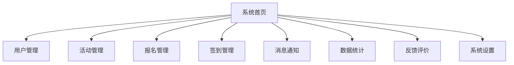

# 智能校园活动管理系统设计文档

---

## 一、需求分析

### 1.1 项目目标

实现一个支持校园活动全流程管理的智能系统，提升活动组织效率与参与体验，支持多角色权限、活动报名、签到、数据统计、反馈等功能。

### 1.2 功能需求

-   用户管理：注册、登录、信息维护、角色分配、权限控制
-   活动管理：活动发布、编辑、审核、删除、详情展示、图片上传
-   报名管理：在线报名、取消报名、报名人数限制
-   签到管理：二维码签到、手动签到、签到统计与导出
-   消息通知：活动推送、系统消息、未读提醒
-   数据统计：活动参与度、签到率、活跃度排行、数据可视化
-   反馈评价：活动反馈、评分、意见收集
-   系统设置：参数配置、角色权限管理

### 1.3 非功能需求

-   前后端分离，RESTful API
-   响应速度快，界面友好
-   数据安全、权限隔离
-   可扩展性、可维护性
-   支持移动端适配

---

## 二、功能结构图



---

## 三、用例图

```mermaid
usecase
  :用户: --> (注册/登录)
  :用户: --> (浏览活动)
  :用户: --> (报名活动)
  :用户: --> (签到)
  :用户: --> (提交反馈)
  :管理员: --> (审核活动)
  :管理员: --> (发布活动)
  :管理员: --> (统计分析)
  :管理员: --> (权限管理)
```

---

## 四、数据库设计

### 4.1 表结构

-   用户表（user）
-   活动表（activity）
-   报名表（registration）
-   签到表（attendance）
-   消息通知表（notification）
-   反馈表（feedback）
-   角色表（role）
-   用户角色关联表（user_role）

### 4.2 字段设计

#### 用户表 user

| 字段名      | 类型         | 说明     |
| ----------- | ------------ | -------- |
| id          | BIGINT       | 主键     |
| username    | VARCHAR(50)  | 用户名   |
| password    | VARCHAR(100) | 密码     |
| real_name   | VARCHAR(50)  | 真实姓名 |
| email       | VARCHAR(100) | 邮箱     |
| phone       | VARCHAR(20)  | 手机号   |
| avatar      | VARCHAR(255) | 头像     |
| status      | TINYINT      | 状态     |
| create_time | DATETIME     | 创建时间 |

#### 活动表 activity

| 字段名       | 类型         | 说明      |
| ------------ | ------------ | --------- |
| id           | BIGINT       | 主键      |
| title        | VARCHAR(100) | 活动标题  |
| description  | TEXT         | 活动描述  |
| location     | VARCHAR(100) | 地点      |
| start_time   | DATETIME     | 开始时间  |
| end_time     | DATETIME     | 结束时间  |
| publisher_id | BIGINT       | 发布人 ID |
| status       | TINYINT      | 状态      |
| create_time  | DATETIME     | 创建时间  |

#### 报名表 registration

| 字段名        | 类型     | 说明     |
| ------------- | -------- | -------- |
| id            | BIGINT   | 主键     |
| user_id       | BIGINT   | 用户 ID  |
| activity_id   | BIGINT   | 活动 ID  |
| register_time | DATETIME | 报名时间 |
| status        | TINYINT  | 状态     |

#### 签到表 attendance

| 字段名      | 类型        | 说明     |
| ----------- | ----------- | -------- |
| id          | BIGINT      | 主键     |
| user_id     | BIGINT      | 用户 ID  |
| activity_id | BIGINT      | 活动 ID  |
| sign_time   | DATETIME    | 签到时间 |
| sign_type   | VARCHAR(20) | 签到方式 |

#### 消息通知表 notification

| 字段名      | 类型         | 说明        |
| ----------- | ------------ | ----------- |
| id          | BIGINT       | 主键        |
| user_id     | BIGINT       | 接收用户 ID |
| content     | VARCHAR(255) | 消息内容    |
| is_read     | TINYINT      | 是否已读    |
| create_time | DATETIME     | 发送时间    |

#### 反馈表 feedback

| 字段名      | 类型     | 说明     |
| ----------- | -------- | -------- |
| id          | BIGINT   | 主键     |
| user_id     | BIGINT   | 用户 ID  |
| activity_id | BIGINT   | 活动 ID  |
| content     | TEXT     | 反馈内容 |
| rating      | INT      | 评分     |
| create_time | DATETIME | 反馈时间 |

#### 角色表 role

| 字段名      | 类型         | 说明     |
| ----------- | ------------ | -------- |
| id          | BIGINT       | 主键     |
| name        | VARCHAR(50)  | 角色名   |
| description | VARCHAR(100) | 角色描述 |

#### 用户角色关联表 user_role

| 字段名  | 类型   | 说明    |
| ------- | ------ | ------- |
| id      | BIGINT | 主键    |
| user_id | BIGINT | 用户 ID |
| role_id | BIGINT | 角色 ID |

---

## 五、接口设计

### 5.1 用户相关

-   POST /api/auth/login 登录
-   POST /api/user/register 注册
-   GET /api/user/info 用户信息
-   PUT /api/user/update 修改信息
-   GET /api/user/list 用户列表（管理员）

### 5.2 活动相关

-   GET /api/activity/list 活动列表
-   GET /api/activity/{id} 活动详情
-   POST /api/activity/create 创建活动
-   PUT /api/activity/update/{id} 编辑活动
-   DELETE /api/activity/delete/{id} 删除活动
-   POST /api/activity/audit/{id} 审核活动

### 5.3 报名与签到

-   GET /api/registration/{id} 查看报名状态
-   POST /api/registration/apply 报名
-   DELETE /api/registration/cancel/{id} 取消报名
-   GET /api/registration/list/{activityId} 报名列表（仅管理员可以查看）
-   DELETE /api/registration/delete/{id} 删除报名记录（即取消指定用户报名，仅管理员可以操作）
-   POST /api/attendance/generate 生成签到码（使用Server-Sent Events技术推送签到码，直接推送临时URL，管理员前端生成二维码）
-   备注：签到码30秒刷新一次，使用TOTP技术（时间同步一次性密码算法）生成动态签到码
-   POST /api/attendance/sign 签到（扫码或在签到列表中手动签到）
-   备注：签到时需要验证签到码的有效性且签到码仅在生成后的30秒内有效，无窗口期
-   GET /api/attendance/list/{activityId} 签到列表（可以设置已签/迟到/未签等状态）

### 5.4 消息通知

-   GET /api/notification/list 消息列表（未读优先，每个人的消息都不同）
-   PUT /api/notification/read/{id} 标记已读

### 5.5 反馈评价

-   POST /api/feedback/submit 提交反馈
-   GET /api/feedback/list/{activityId} 反馈列表（只有管理员能查看）

### 5.6 权限与系统设置

-   GET /api/role/list 角色列表
-   POST /api/role/assign 分配角色（只有管理员能操作）
-   GET /api/config 系统参数（只有管理员能查看）

---

## 六、前后端技术方案

### 6.1 后端

-   Spring Boot + MyBatis + MySQL
-   JWT 鉴权、RBAC 权限模型
-   RESTful API、分层架构
-   Swagger 生成文档、Maven 管理依赖

### 6.2 前端

-   React.js + MUI(Material UI)
-   React Router、Axios、ECharts
-   响应式布局、组件化开发

---

## 七、页面设计

-   登录/注册页
-   活动列表页
-   活动详情页
-   活动发布/编辑页
-   报名/签到页
-   个人中心页
-   数据统计页
-   消息通知页
-   反馈评价页
-   管理员后台页

---

## 八、权限与安全设计

-   JWT 登录态管理
-   RBAC 角色权限控制
-   接口权限校验
-   数据加密存储（如密码加密）
-   防止 SQL 注入、XSS 等安全风险

---

## 九、部署方案

-   后端：Docker 容器化部署，Nginx 反向代理
-   前端：静态资源部署至 Nginx
-   数据库：MySQL 服务器，定期备份
-   支持本地开发与生产环境切换

---

## 十、测试方案

-   单元测试（Junit、Mockito）
-   接口测试（Postman、Swagger）
-   前端功能测试（Jest、React Testing Library）
-   集成测试与系统测试
-   用户验收测试

---

## 十一、文档结构

-   项目计划书（PLAN.md）
-   需求规格说明书
-   数据库设计文档
-   接口文档
-   系统部署文档
-   用户手册
-   测试报告
-   答辩 PPT

---
